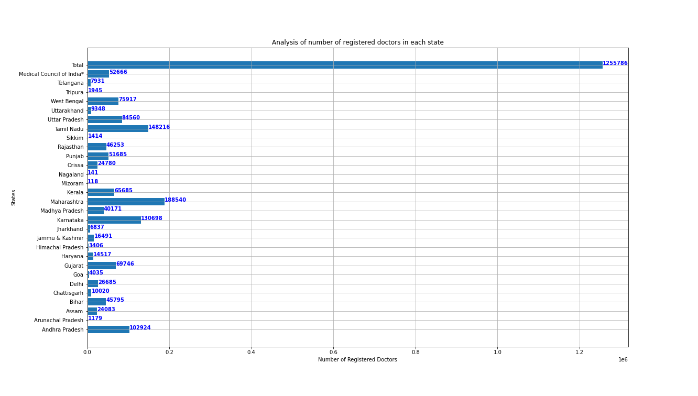
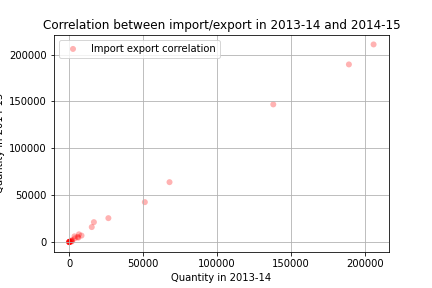

# Analysis of plots

Here, we demonstrate the use of a scatter plot and a bar plot. We pick two datasets: [State-wise number of registered doctors](https://github.com/abhipsabasu/Plots_DS200/blob/main/RS_Session_252_AU_236.csv) and [Import Export quantities of different products over various years](https://github.com/abhipsabasu/Plots_DS200/blob/main/Table-2020_43.csv). For the bar plot, we show the distribution of the number of doctors statewise, as below: 

    

As we can see, the state wise analysis of number of registered doctors is seen here very clearly.
The 2nd plot is a scatter plot. Here we are trying to find the correlation between quantities of import and export of different products over a period of two years. Following is the scatter plot:

    

The trend shows a positive correlation between the import export quantities of two consecutive years.